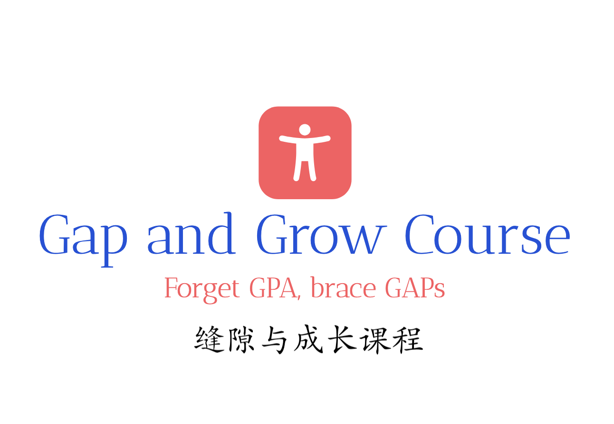

# 缝隙与生长：学会在未知中生活

## 课程介绍

现在很多同学像被按下了快进键，忙着超前学习、管理时间，却好像丢了感受生活打破常规的勇气。就像被关在‘已知’的盒子里，就像这潭池水和聚光灯。我们想打破这种‘窒息感’、精致的安全、单一的光彩，让大家能在学习中找到‘缝隙’，重新发现和生长出好奇心和创造力。

我见过太多学生被‘标准答案’束缚，失去了提问的勇气。每个孩子都该有自由生长的空间，这是教育本该有的样子。

跨学科的魅力在于打破边界，就像我们的项目，就是要为教育打开新的窗口，这对每个孩子的成长都意义重大。

快乐不需要精致的安全，在游戏中发现自我和自然的同频共振。儿童的想象力和创造力是不怕失败和五光十色的。

童年是一段时光，童真是一种态度。在真实的共同的经验中体会溪流的汇集，成为彼此的光亮。

我们相信，每一道缝隙都可能成为生长的起点。期待和你们一起，在未知中遇见更棒的自己和世界！

## 课程花絮

## 课程回顾

## 互动留言 & 联系方式

